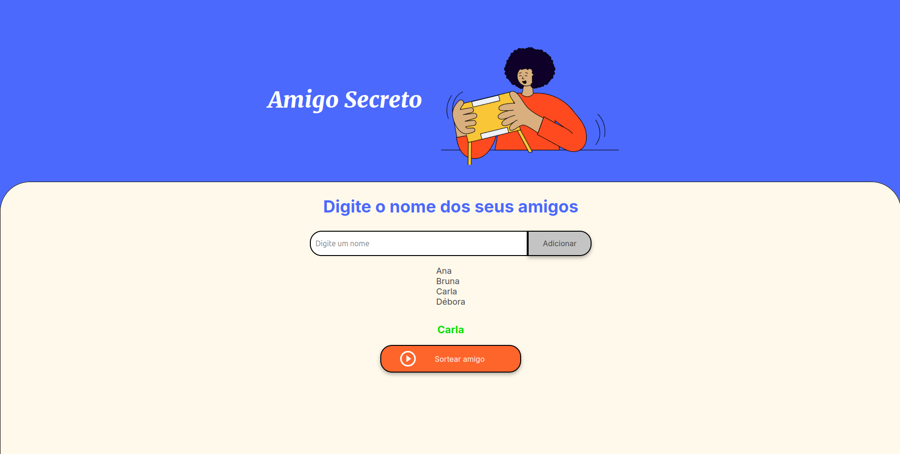

# 🔒 Amigo Secreto [](https://github.com/RonaldFrony/amigo-secreto) [](https://github.com/RonaldFrony/amigo-secreto) [](https://amigo-secreto-red-omega.vercel.app/)

Um projeto simples para realizar sorteios de Amigo Secreto de forma dinâmica e aleatória. Desenvolvido como parte do desafio do programa ONE (Oracle Next Education) da Alura.

 
## 🚀 Funcionalidades

- **Adicionar participantes:** Insira nomes dos amigos para o sorteio.
- **Validação de dados:** Impede nomes vazios, numéricos ou repetidos.
- **Sorteio aleatório:** Realiza o sorteio usando algoritmos justos.
- **Interface intuitiva:** Design limpo e responsivo.

## 🛠️ Tecnologias Utilizadas

- **HTML5**
- **CSS3** (Flexbox, Grid, Media Queries)
- **JavaScript Vanilla**

## 📦 Instalação e Uso

[](https://amigo-secreto-red-omega.vercel.app/)

1. **Clone o repositório:**
   ```bash
    git clone https://github.com/RonaldFrony/amigo-secreto.git

2. **Acesse a pasta do projeto:**

    ```bash
    cd amigo-secreto

3. **Abra no navegador:**

    Dê um duplo clique no arquivo index.html ou use um servidor local.
